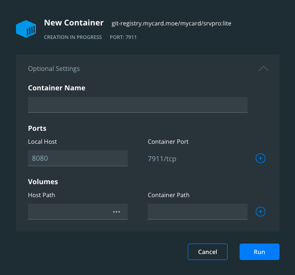

# YGOPro服务端前期调研

## 大致整体架构



## 部署方法
### 云服务器部署
- 第一步：下载`srvpro`项目
  - `git clone git@github.com:mycard/srvpro.git`
  - `cd srvpro`
  - `npm install`
- 第二步：编译`ygopro`项目
  - `git clone git@github.com:mycard/ygopro.git`(在srvpro目录下)
  - `cd ygopro`
  - `git checkout server`(切换到server分支)
  - `git submodule update --init --recursive`(初始化git子项目)
  - `wget -O - https://github.com/premake/premake-core/releases/download/v5.0.0-beta1/premake-5.0.0-beta1-linux.tar.gz | tar zfx -`(下载premake5)
  - `wget -O - https://www.lua.org/ftp/lua-5.3.6.tar.gz | tar zfx -; cd lua-5.3.6; sudo make linux install; cd ..`(下载lua)
  - `mv lua-5.3.6 lua`
  - `cp ./premake/lua/premake5.lua ./lua`
  - `./premake5 gmake`(生成makefile)
    - mac平台下是`./premake5 gmake --cc=clang`
    - M1平台下是`./premake5 gmake --cc=clang --mac-arm`
  - `cd build && make config=release && cd..`(编译，这步完成后ygopro/bin/release目录下会生成ygopro可执行文件)
  - `ln -s bin/release/ygopro ./`(创建软链接)
  - `strip ygopro && cd ..`(ygopro编译完成，返回srvpro目录)
- 第三步：创建`config/config.json`文件
  - `mkdir config`
  - `cp data/default_config.json config/config.json`
- 第四步：运行`ygopro-server.js`
  - `node ygopro-server.js`

以上四步完成后，就可以在ygopro客户端上连接部署的服务了。

查看云服务器公网ip：
```bash
curl ifconfig.me
```

运行`ygopro-server.js`后，控制台输出日志中会显示ygopro服务端监听的端口，默认是`7911`。

在ygopro客户端中点击`联机模式`，然后在弹出的窗口中将对应的ip地址和端口输入，即可进入房间了。
如果成功进入了房间，则表示成功在云服务器中部署了ygopro服务端。


### 本机部署
流程和云服务器部署一样。

在本机部署后，本机启动的ygopro客户端可以通过ip地址`127.0.0.1`连接部署好的服务。

### docker部署
- 第一步：下载docker
  - [docker菜鸟教程](https://www.runoob.com/docker/docker-tutorial.html)
- 第二步：拉取srvpro镜像
  - `docker pull git-registry.mycard.moe/mycard/srvpro:lite`
- 第三步：运行docker容器，并完成端口映射
  - 如何运行docker容器和什么是端口映射可以参考[docker菜鸟教程](https://www.runoob.com/docker/docker-container-usage.html)
  - 下图将docker内的`7911`端口映射到了本机的`8080`端口：

完成以上三步后即可在ygopro客户端上连接ygopro服务端了，ip地址为本机ip地址，端口为映射后的本机端口（`8080`）。
  
## 数据协议
ygopro客户端与服务端通过非http协议进行通信。

数据包格式如下（参考[网页](https://www.icode9.com/content-1-1341344.html)）：
```
 16bit packet_len     8bit proto          exdata_len  exdata
+------------------+---------------+-------------------------+
				   |-              data					    -|

其中第一部分为packet_len,长度2个字节,数值是 exdata_len + 1,即后面内容的长度总和
第二部分是 proto,长度1个字节, 表示后面 exdata 的类型
第三部分是 exdata,一些特定的proto会附带这部分内容,长度不定.上面提到的core传出来的buffer在这部分中

后面两部分统称为data

这个packet的最终长度是packet_len+2.
服务器和客户端处理packet之前跳过了前2个字节.
```

其中`proto`的10进制代码和字符串描述如下：
```json
"CTOS": {
    "1": "RESPONSE",
    "2": "UPDATE_DECK",
    "3": "HAND_RESULT",
    "4": "TP_RESULT",
    "16": "PLAYER_INFO",
    "17": "CREATE_GAME",
    "18": "JOIN_GAME",
    "19": "LEAVE_GAME",
    "20": "SURRENDER",
    "21": "TIME_CONFIRM",
    "22": "CHAT",
    "32": "HS_TODUELIST",
    "33": "HS_TOOBSERVER",
    "34": "HS_READY",
    "35": "HS_NOTREADY",
    "36": "HS_KICK",
    "37": "HS_START",
    "48": "REQUEST_FIELD"
},
"STOC": {
    "1": "GAME_MSG",
    "2": "ERROR_MSG",
    "3": "SELECT_HAND",
    "4": "SELECT_TP",
    "5": "HAND_RESULT",
    "6": "TP_RESULT",
    "7": "CHANGE_SIDE",
    "8": "WAITING_SIDE",
    "9": "DECK_COUNT",
    "17": "CREATE_GAME",
    "18": "JOIN_GAME",
    "19": "TYPE_CHANGE",
    "20": "LEAVE_GAME",
    "21": "DUEL_START",
    "22": "DUEL_END",
    "23": "REPLAY",
    "24": "TIME_LIMIT",
    "25": "CHAT",
    "32": "HS_PLAYER_ENTER",
    "33": "HS_PLAYER_CHANGE",
    "34": "HS_WATCH_CHANGE",
    "48": "FIELD_FINISH"
}
```
其中`CTOS`表示客户端到服务端协议，`STOC`表示服务端到客户端协议。

详细可以参考[constants.json](https://github.com/mycard/srvpro/blob/master/data/constants.json)。

每个`proto`对应的含义和使用场景：TODO。

## 代码导读
- 处理网络连接：[ygopro-server.js](https://github.com/mycard/srvpro/blob/master/ygopro-server.js)中的`netRequestHandler`函数；
- CTOS/STOC协议解析：[YGOProMessages.ts](https://github.com/mycard/srvpro/blob/master/YGOProMessages.ts)中的`handleBuffer`函数；
- `ygopro`的主函数入口点：[gframe.cpp](https://github.com/mycard/ygopro/blob/server/gframe/gframe.cpp)；
- `ygopro`处理CTOS数据包：[netserver.cpp](https://github.com/mycard/ygopro/blob/server/gframe/netserver.cpp)中的`NetServer::HandleCTOSPacket`函数；
- `ygopro`中和数据协议相关的结构体或宏定义：[network.h](https://github.com/mycard/ygopro/blob/server/gframe/network.h)。

