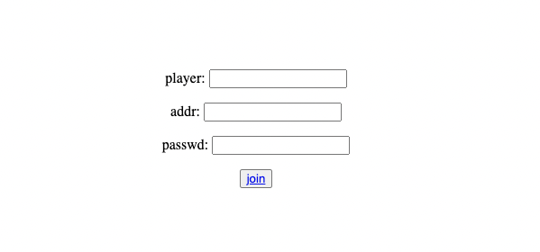
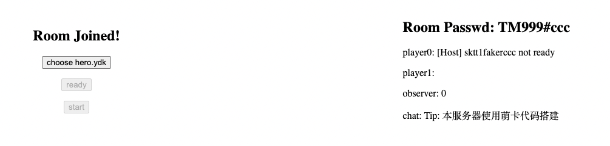

2022-07-01至2022-10-07进展
==========================

前言
----

在2022年6月份的时候，我处于即将大学本科毕业，进入社会参与工作之际。 虽然从事的行业是互联网行业而非游戏行业，但我始终存在一份想要参与游戏研发的心意， 希望有一天能参与像[只狼](https://zh.wikipedia.org/zh-cn/%E9%9A%BB%E7%8B%BC%EF%BC%9A%E6%9A%97%E5%BD%B1%E9%9B%99%E6%AD%BB) 这样能给玩家带来心灵上震撼的艺术作品的研发工作，同时也向往着像[刀剑神域](https://zh.wikipedia.org/wiki/%E5%88%80%E5%8A%8D%E7%A5%9E%E5%9F%9F) 这样充满冒险元素的空想世界。

萌生想制作Web版ygopro想法的契机是临近毕业时，那时候论文答辩也通过了，于是和同学一起玩游戏王卡牌游戏。

游戏王是我童年时最喜欢的日漫（99年生），当时小学每周五最期待的就是放学回家在香港台上看粤语版游戏王动漫。 最喜欢二代主角游城十代。那时候收集了很大一箱游戏王卡牌，可惜在上初中后都扔掉了。

当时从同学那边听说现在游戏王卡牌游戏还是有很大一部分团体在玩，甚至国内还有社区伙伴制作的同人对战平台[ygopro](https://ygopro.org/) 的时候，还是挺惊讶的。玩了几局，发现ygopro完成度非常得高，基本上所有卡的效果都能正确处理。

因为当时也没事，于是去看了下ygopro的源码，在逐渐了解整个的运作流程后，自然而然地产生想要制作Web版ygopro的想法（目前只支持PC/Android平台）。 现在回想，不太清楚当时的脑回路了，不过大概可以总结为以下几点：

-	对游戏王怀有童年情结；
-	对游戏开发念念不忘；
-	希望可以拓展下技术栈，包括前端和后端（目前我在工作中是偏Rust/C++的系统技术栈，之前大学时也是偏底层技术栈）；
-	[主要]希望在工作之余做一些自己喜欢的东西。

不管怎样，从7月初开始到现在，已经坚持了3个月的时间，同时这也是我参与工作后经历的第一个季度。 在这个季度中，Web版ygopro的研发工作在周末中稳步推进，到目前为止已经攻克了多个技术难关， 剩下的大多是编写业务逻辑，和ygopro服务端测试联调等工作，难度不高，但工作量大。

下面将逐一介绍下主要进展和后续研发规划。在这之前，读者们可以先简单阅读下以下几篇前置文档：

-	[项目介绍](../../README.md)
-	前期调研：
	-	[服务端调研](../investigation/server-side.md)；
	-	[数据协议调研](../investigation/protocol.md)。

总体进展
--------

Web版ygopro，被我起名**Neos**（E-hero Neos），整体架构设计如下：

其中：

-	[neos-ts](https://github.com/DarkNeos/neos-ts)是前端模块，主要负责UI展示，使用[Typescript语言](https://www.typescriptlang.org/)\+[React框架](https://reactjs.org/)\+[Three.js框架](https://threejs.org/)编写；
-	[ygopro-proxy](https://github.com/DarkNeos/ygopro-proxy)是协议代理模块，主要负责Tcp协议和Websocket协议之间的数据转发以及RawBuffer和[Protobuf](https://developers.google.com/protocol-buffers) 之间的格式转换，使用[Go语言](https://go.dev/)编写；
-	[srvpro](https://github.com/mycard/srvpro)是萌卡社区维护的ygopro服务端模块，为了实现Neos能和客户端平台进行联机对战，这里复用srvpro项目；
-	[neos-rs](https://github.com/DarkNeos/neos-rs)是Neos的账号管理/卡图资源/3D模型资源服务，用[Rust语言](https://www.rust-lang.org/)编写。

**整体架构，涉及技术栈基本确定**，Websocket/Tcp/CORS/拆包等基建相关技术难点大多已得到解决。

同时，通过完成加入房间，选择卡组，更新状态的简单Demo，**确认了整套研发流程的可行性**。

剩下的工作主要是分析ygopro数据协议，并以其为基础编写游戏对局相关的业务逻辑。

前端展示
--------

前端项目neos-ts是整个项目中最为核心的模块，主要负责处理用户交互逻辑和根据服务端结果进行UI展示，同时还负责3D渲染的工作。

目前neos-ts只实现了极为简陋的加入房间Demo： 

后续主要研发方向是实现游戏对局中决斗盘，卡牌效果的UI渲染。

协议代理
--------

可能有朋友会疑惑为什么会有ygopro-proxy这个协议代理层？

原因是Web应用要想实现全双工的网络连接，只能使用基于Http协议之上的Websocket协议，无法使用Tcp协议；而ygopro服务端是使用Tcp协议和原生buffer进行数据传输的。 因此为了实现Web版ygopro能和客户端版ygopro联机对战的目标，设计了ygopro-proxy这个协议代理层，它负责Tcp协议和Websocket协议之间的数据转发。

在此思想的基础上，考虑再进一步将ygopro服务端的原生buffer数据协议在ygopro-proxy进行解析，并转换成[ProtoBuf](https://developers.google.com/protocol-buffers)格式，再传给前端。

这么做有两点原因：

-	对于前端应用来说解析原生buffer数据十分困难，Typescript中数字类型只有`number`而没有`int8`，`int32`等细分；
-	使用`Protobuf`作为数据协议格式是一种较为成熟的做法，目前我工作中的项目中也是通过`Protobuf`格式进行前后端的数据传输。

ygopro-proxy已经完全运行起来，并稳定地支撑了Demo的正常运行。虽然在后续需要考虑并发，容错的细节问题，目前看起来它的功能实现是正确的。

后续主要研发方向是实现更多ygopro协议的转发，支撑更多的业务逻辑。

资源服务
--------

前端项目应该是`按需渲染的`，比如，当玩家抽到某张卡时，需要渲染这张卡的图片时；又或者当某个高阶怪兽被成功召唤，需要渲染这个怪兽的3D动画时，需要从资源服务获取相关的卡图资源 或3D模型资源。

neos-rs是用Rust语言实现的资源服务，目前仅支持获取卡组资源。

后续主要研发方向是支持用户或者更多的资源。

尾声
----

这个项目从启动开始到现在，经过了3个月的研发周期，尽管还没有实际性的，视觉效果上的巨大进展，但我相信若能坚持下去，会得到好的结果。

到目前为止整个项目只有我一个人在进行研发，有点像是我一个人的自娱自乐。同时这个的工作量不低，我个人平时也还要在内卷严重的互联网行业上班，有时候真的感到力不从心。 因此我很希望能有朋友跟我一起参与这个项目，大家形成一个团队，一个社区，共同来做这个有价值（起码我个人觉得是的）的事情。 我会对参与进来的**学生**开发者承诺：

-	在此项目的开发中，我会力所能及地提供帮助，包括技术选型和具体实现逻辑；
-	我会分享自己在国内大厂中见过的各种技术/解决方案/成熟做法；
-	并且提供内推；
-	你的简历上可以写上此项目作为应聘的筹码。

有意者可以通过下面的二维码进入QQ群聊进行交流：

或者可以通过邮箱与我沟通，我每天都会check自己的个人邮箱：linuxgnulover@gmail.com

感谢阅读
--------
